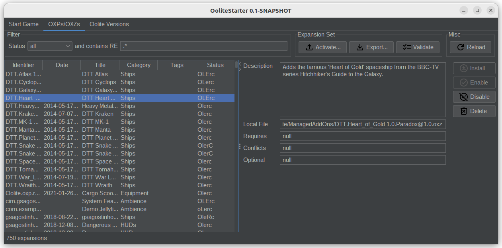
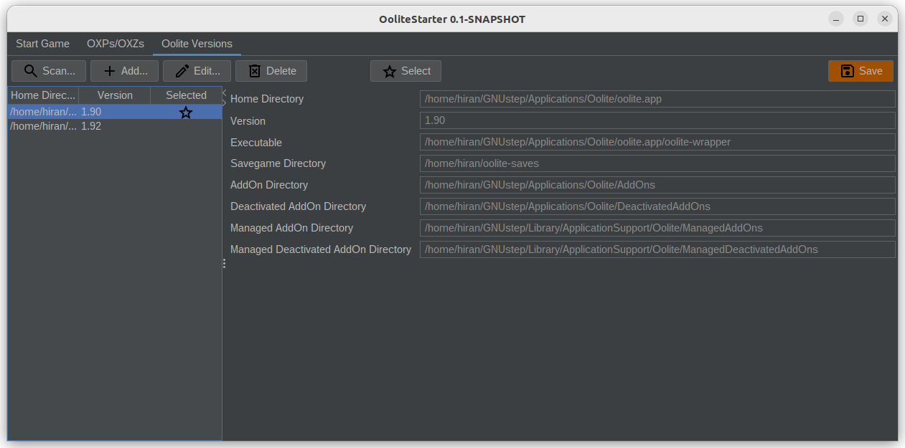
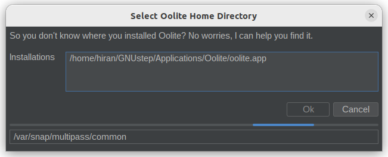

# Oolite Starter

The Oolite Starter allows users to more comfortably preconfigure Oolite
for various missions. It's main purpose is to ease OXP management, Oolite versions
and manage save games.

## Requirements (generic package only)

* You need to have Java SDK 17 or newer installed. 
  If you are unfamiliar with installing Java on Linux, follow
  https://www.youtube.com/watch?v=7lzIP-PvHoY
  If you are unfamiliar with installing Java on MacOS, follow
  https://www.youtube.com/watch?v=wXotUgqOdh8
  If you are unfamiliar with installing Java on Windows, follow
  https://www.youtube.com/watch?v=IJ-PJbvJBGs
* You need to have a copy of the generic Oolite Starter unzipped in a directory of
  your choice. Just in case, you can download it from
  https://github.com/HiranChaudhuri/OoliteStarter/releases

## Installation and Uninstallation

### Generic Package

Download the .tar.gz or the .zip file and extract in a directory of your choice.
You likely want to create a shortcut to run.sh or run.cmd.

To remove the software, just delete the directory you have created.

### Linux (.deb)

Download the .deb file. Run

    sudo apt install <path to downloaded .deb>

After that you should see a new icon in your desktop environment.

To remove the software, run

    sudo apt remove oolitestarter

### MacOS (.dmg)

The .dmg download has not yet been successfully installed. If you manage to
succeed, please give a shout.

### Windows (.exe)

Download the .exe file. Tell Windows you want to keep the file regardless of
warnings. Then run the installer. It will automatically install OoliteStarter
and create menu and desktop shortcuts.

To remove the software, go to control panel/apps. Search for OoliteStarter
and choose to uninstall.

## Configuration (Installations)

When you run the application, it will seach the configuration file
$HOME/.oolite-starter.conf

If this file is not present, do not worry. A warning will be displayed and the
application will run. Switch to the Installations tab and add at least one
Oolite installation. Then press Save and the missing file will be created.

For each Oolite installation you can define a number of places in the filesystem.
Since some players have multple such installations in parallel, they can be
configured once.

Oolite-Starter needs to know which installation it should actually use. Select
the one of your choice and press the Activate button. At this time OoliteStarter
will check if some directory is missing and also offers to create it for you.

## Usage (Quickstart)

* Run the application. Depending on your operating system and the package you 
  chose this may mean to just click an icon, a menu entry or use either 
  run.sh or run.cmd. When going for run.sh you may need to set execute
  permissions (chmod +x run.sh)
* The Starter will present you with the list of your save games. Either press
  the 'New' button to run a new game, or choose the save game and press 'Continue'.
  Either of those buttons will run Oolite the way you chose.
* Play as usual.
* If you want to change the installed expansions, switch to the 'Expansions' tab,
  check the list and choose to install, remove, enable or disable single expansions.
  You can also export your currently active expansions as 'Oolite Expansion Set',
  and load it later again or share with your friends.

Happy Flying!

## Usage (Detailed description)

In the following you will find detailed description of each of these use cases:

### SaveGames

Here is what you can do:

This is what it looks like:

In case OoliteStarter triggered Oolite and is waiting for the process to finish
it looks like this:

#### New

Starts Oolite the usual way. You can use it to start a new commander.

#### Resume

Starts Oolite with the selected savegame. The game will be loaded from disk so
you can continue that game. Requires that you saved the game before from
within Oolite.

#### Delete

Deletes the selected savegame.

#### Reload

Loads data freshly from disk. This is similar to pressing reload in your web 
browser. OoliteStarter reloads the data automatically when a change is likely to
have happened. If you still feel the data might be outdated just click here.

### Expansion Management

Here is what you can do:

This is what it looks like:

Expansions follow this lifecycle. It should explain why in Oolite Versions 
Management so many directories need to be configured.

While OXZs that are listed on the Expansion Manager's manifest can have a full
lifecycle through install and delete, OXPs that are found in the Addons folder
cannot be installed. They do not come with a download URL.

#### Install

Installs an OXZ from the Expansion Manager's manifest.

#### Delete

Deletes the selected OXZ or OXP from your disk.

#### Activate

Activates an OXZ or OXP. This is done by moving it to the folder that Oolite
will read on startup (the Addons and ManagedAddons folders).

#### Deactivate

Deactivates an expansion by moving it to a folder where Oolite will not find it
(the DeactivatedAddons and ManagedDeactivatedAddons folders).
The expansion remains in that hidden location until you either delete or enable
it.

#### Reload

Loads data freshly from disk. This is similar to pressing reload in your web 
browser. OoliteStarter reloads the data automatically when a change is likely to
have happened. If you still feel the data might be outdated just click here.

#### Export Expansion Set

With the above use cases you can assemble a bunch of expansions that you may
want to backup or share with other players. This export function allows you to
list all the enabled expansions in a file.

Keep it as backup information, or send it to others as you like.

#### Activate Expansion Set

If you have an expansion set file - as it was created with the Export function
- you can recreate that setup by activating it. OoliteStarter will
disable expansions that should not be there, enable those that are required and
available locally. Finally it will download and install those that are still 
missing.

Regardless what you had before, after this function has run your setup should be
exactly what was defined in the file.
expansion set file.

#### Validate Expansion Set

This use case checks each of the enabled expansions' requires and conflict lists.
If something sticks out you will be informed.

### Oolite Versions Management

Here is what you can do:

This is what it looks like:

#### Add

Brings up a configuration dialog that allows you entering all the relevant
directory paths for Oolite. Once you press Ok you can see the new version
to be added to the list of versions.

#### Scan

In case you want OoliteStarter to search for Oolite on your behalf just click
this button. 

While the search is running you can already accept one of the 
Oolite home directories found so far. As soon as you click Ok the system
switches to Add mode allowing you to tweak the settings before they are added
to the list of versions.

#### Remove

Removes the selected version from the list.

#### Edit

Allows you to change settings in the selected version.

#### Activate

Since you can have multiple versions configured, OoliteStarter needs to know
which of the settings to work with. The Select button will activate the selected
version. Only one version can be active at any time. It is marked with a star.

#### Save

All the version settings are just held in RAM and lost when you exit 
OoliteStarter. Press Save if you want these settings to be available when you
next time run OoliteStarter.

The configuration data is stored in $HOME/.oolite-starter.conf.